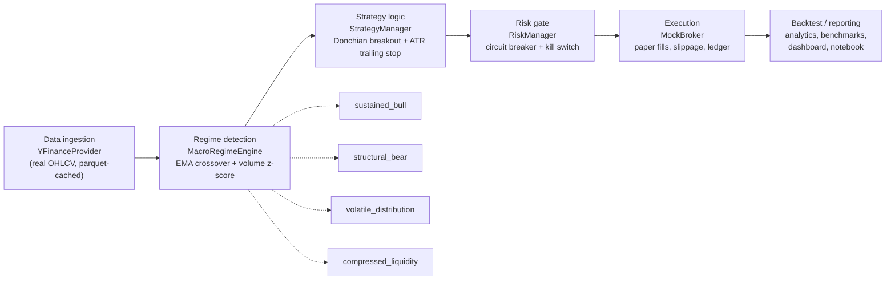
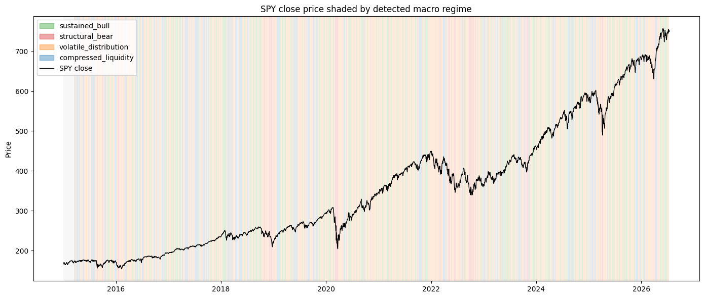
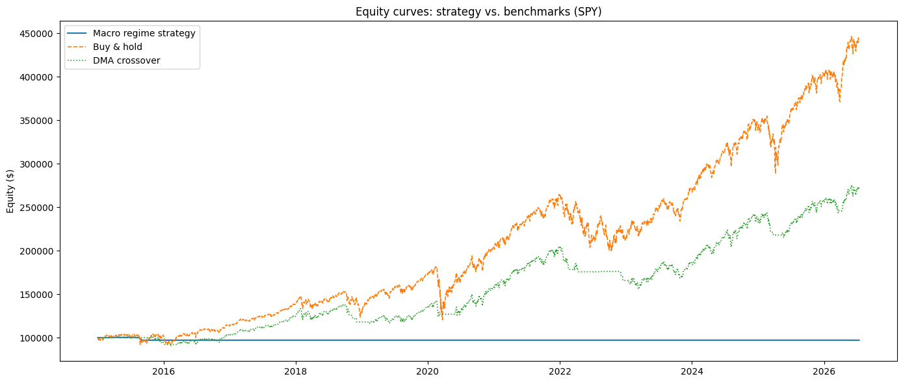
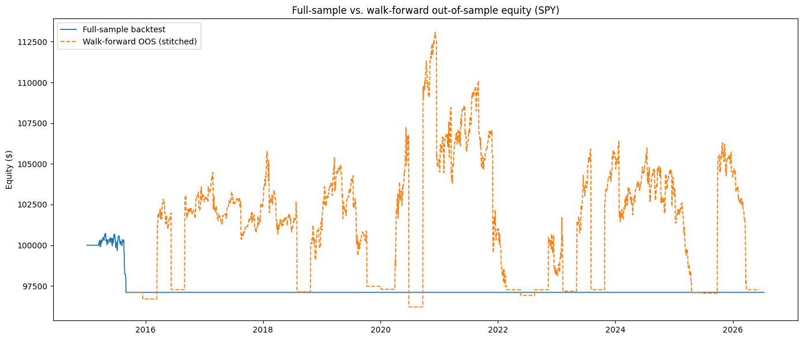

# Macro Regime Trader

[](https://github.com/thompgt/macro-regime-trader/actions/workflows/ci.yml)

A quantitative trading **simulation** engine that detects macroeconomic/market
regimes from real historical price data, adaptively sizes exposure per
regime, and enforces strict capital-preservation risk limits. It trades
against a local paper-trading broker only — there is no live order routing
and no broker API keys are required.

**Not investment advice.** This is a research/education project.

## What is a "macro regime" strategy, and why this shape?

Markets don't behave the same way all the time. A trend-following approach
that thrives in a calm, low-volume uptrend can get shredded during a violent
distribution phase, and a strategy tuned for choppy conditions leaves money
on the table in a clean bull run. A **macro regime** strategy's premise is:
classify *what kind of market this is right now* first, and only then decide
how much risk to take and how to size positions — instead of applying one
fixed rule set to every environment.

This repo splits that idea into four independent, testable stages instead of
one monolithic "trading bot":

- **Regime detection** is pure classification (momentum + participation), with
  no notion of positions or money — it can be unit-tested against synthetic
  price paths in isolation.
- **Strategy sizing** turns a regime label into a target exposure, but never
  touches an order — it just proposes a `Signal`.
- **Risk management** is the single choke point every signal must pass
  through before it can reach the broker, so circuit breakers and kill
  switches can't be bypassed by a bug elsewhere.
- **Execution** (the mock broker) is the only stage that touches money,
  making it easy to swap in a real broker later without touching the
  regime/strategy/risk logic at all.

Shared contracts (`Regime`, `Signal`, `RiskDecision`, `Fill` in `types.py`)
keep those four stages decoupled — each one only needs to know the shape of
its input and output, not how any other stage is implemented.

## Pipeline



## Quickstart

```bash
git clone https://github.com/thompgt/macro-regime-trader.git
cd macro-regime-trader
pip install -e ".[dev]"

# Run the test suite
pytest -q

# Backtest a real ticker against buy-and-hold and a 200-DMA benchmark
mrt backtest --ticker SPY --start 2015-01-01

# Launch the interactive dashboard
mrt dashboard

# Or open the live walkthrough notebook
jupyter notebook notebooks/demo.ipynb
```

Example `mrt backtest` output:

```
model               total_return    sharpe_ratio    max_drawdown        win_rate
--------------------------------------------------------------------------------
strategy                  0.1296          0.5763         -0.0527          0.4674
buy_and_hold              0.6726          0.7380         -0.2450          0.5379
dma_crossover             0.5478          0.9594         -0.1194          0.4101
```

(The strategy trades off upside for a much smaller drawdown — that trade-off
is the point of the risk layer, not a bug.)

## How it works

Real OHLCV data flows through four stages, in order, on every bar:

```
YFinanceProvider  →  MacroRegimeEngine  →  StrategyManager  →  RiskManager  →  MockBroker
   (real data)          (classify)          (size signal)      (veto/clamp)     (execute)
```

1. **`MacroRegimeEngine`** (`core/macro_engine.py`) — classifies each bar into
   one of four regimes from EMA momentum crossover + rolling volume z-score:
   `sustained_bull`, `volatile_distribution`, `structural_bear`,
   `compressed_liquidity`.
2. **`StrategyManager`** (`core/strategies.py`) — turns the regime into a
   target exposure (0-100%), using Donchian-channel breakout confirmation for
   bull entries and an ATR-based trailing stop that tightens in
   riskier regimes.
3. **`RiskManager`** (`core/risk_manager.py`) — the only gate before
   execution. Halts trading for a cooldown period on a >2.5% intraday
   drawdown (circuit breaker), and permanently locks trading (writes
   `TRADING_LOCKED.json`) on a >12% peak-to-trough drawdown (kill switch).
4. **`MockBroker`** (`simulation/mock_broker.py`) — a stateful, long-only
   paper broker: $100,000 starting balance, 0.04% slippage per trade,
   ratcheting trailing stops, full ledger + equity curve.

`backtest/engine.py` wires all four together for a full-sample run, or a
rolling walk-forward evaluation (`--walk-forward`) that only reports
out-of-sample windows. `backtest/analytics.py` and `backtest/benchmarks.py`
compute Sharpe/drawdown/win-rate and compare against buy-and-hold and a
200-day moving-average crossover.

All market data comes from Yahoo Finance via `yfinance`
(`data/yfinance_provider.py`), cached to local parquet so repeat backtests
don't re-hit the network. Every numeric threshold (EMA windows, risk limits,
slippage, starting balance, walk-forward window sizes, ...) is centralized in
`config.py` and overridable via environment variables or a `.env` file — see
`.env.example`.

## Results

The charts below are real output, captured from an executed run of
`notebooks/demo.ipynb` against real SPY daily OHLCV data pulled through
`yfinance` (full sample: 2015-01-01 through present). Numbers will differ
slightly run-to-run as new bars arrive — these are one concrete snapshot, not
a cherry-picked or fabricated result.

**Regime classification over time.** `MacroRegimeEngine` shading SPY's close
price by detected regime — note how `volatile_distribution` (orange) and
`compressed_liquidity` (blue) dominate outside of the cleanest 2016-2018 and
2023-2024 uptrends, while `structural_bear` (red) only lights up around the
2020 and 2022 drawdowns:



**Strategy vs. benchmarks.** The regime-gated strategy against plain
buy-and-hold and a 200-day moving-average crossover, same data, same start
capital ($100,000):



| model | total_return | sharpe_ratio | max_drawdown | win_rate |
|---|---|---|---|---|
| macro_regime_strategy | -0.0290 | -0.3612 | -0.0359 | 0.0166 |
| buy_and_hold | 3.4307 | 0.8229 | -0.3372 | 0.5478 |
| dma_crossover | 1.7258 | 0.8177 | -0.2406 | 0.4367 |

In this particular full-sample snapshot the risk layer is extremely
conservative — it clamps drawdown to a tenth of buy-and-hold's, but at a real
cost in upside, and the circuit breaker/kill switch logic keeps it flat for
long stretches. That's the explicit trade-off the risk gate is built to make
(see `RiskManager` above); tuning how aggressively it trades that off is an
open area, not a claim that this configuration beats the market.

**Full-sample vs. walk-forward out-of-sample.** `--walk-forward` re-fits and
evaluates on rolling windows so the reported performance only ever reflects
out-of-sample bars — a check against overfitting to the full history:



That run produced 45 out-of-sample windows (2,700 bars) with out-of-sample
metrics of `total_return: 0.0017`, `sharpe_ratio: 0.0474`,
`max_drawdown: -0.1428`, `win_rate: 0.3435` — materially different from the
full-sample numbers above, which is exactly why the walk-forward mode exists.

Reproduce these yourself with `jupyter notebook notebooks/demo.ipynb` (run
all cells) or `mrt backtest --ticker SPY --start 2015-01-01 --walk-forward`.

## CLI

```bash
mrt backtest --ticker SPY --start 2015-01-01 [--end YYYY-MM-DD] [--interval 1d] [--walk-forward]
mrt dashboard [--host 0.0.0.0] [--port 8501]
```

## Dashboard & notebook

- `mrt dashboard` launches a Streamlit app: current regime badge, overlaid
  equity curves (strategy vs. buy-and-hold vs. DMA crossover), and the trade
  ledger.
- `notebooks/demo.ipynb` is the same walkthrough as a live, re-runnable
  notebook — fetch real data, detect regimes, backtest, compare benchmarks,
  and run a walk-forward evaluation, with plots at each step. The charts in
  the [Results](#results) section above were captured from this notebook.

## Docker

```bash
docker build -t macro-regime-trader .
docker run --rm -p 8501:8501 macro-regime-trader          # dashboard
docker run --rm --entrypoint mrt macro-regime-trader backtest --ticker SPY --start 2020-01-01
```

## Project layout

```
src/macro_regime_trader/
  config.py            # centralized, env-overridable settings
  types.py             # shared Regime / Signal / RiskDecision / Fill contracts
  data/                 # DataProvider protocol + real YFinanceProvider
  core/                 # macro_engine, strategies, risk_manager
  simulation/           # mock_broker
  backtest/             # engine, analytics, benchmarks
  dashboard/            # Streamlit app
  cli.py                # `mrt` entry point
tests/                  # one test file per module, no network calls
notebooks/demo.ipynb    # live, executable demo
images/                 # charts referenced from this README
```

## Development

```bash
pip install -e ".[dev]"
pytest -q               # 36 tests, no network required
ruff format . && ruff check .
mypy src
```

CI (`.github/workflows/ci.yml`) runs lint, format-check, type-check, and
tests on Python 3.11/3.12 for every push and PR.

See `workplan.md` for the build milestone history and `CLAUDE.md` for the
working conventions (commit frequently, keep contracts in `types.py`, etc.)
used while building this project with Claude Code.
