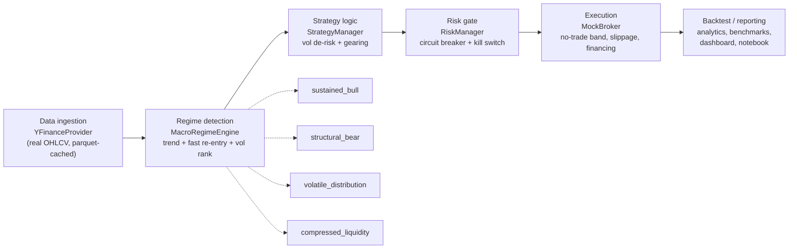
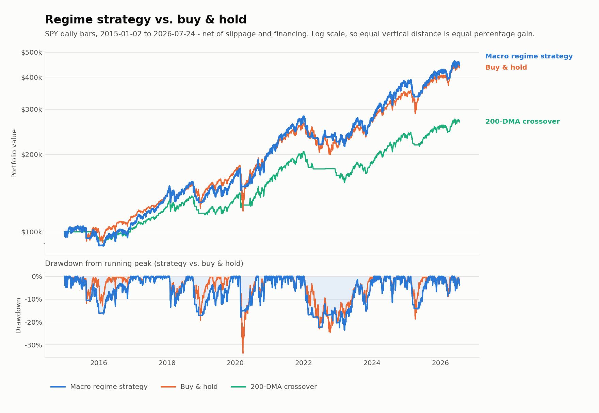
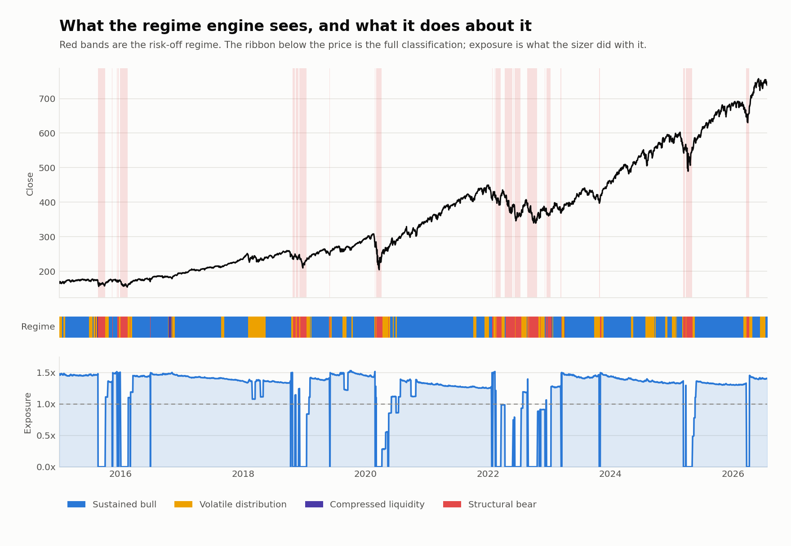
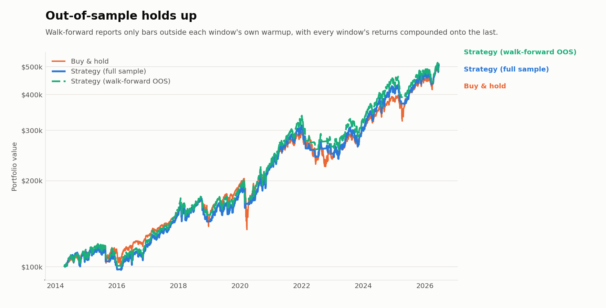

# Macro Regime Trader

[](https://github.com/thompgt/macro-regime-trader/actions/workflows/ci.yml)

A quantitative trading **simulation** engine that detects macroeconomic/market
regimes from real historical price data, adaptively sizes exposure per
regime, and enforces strict capital-preservation risk limits. It trades
against a local paper-trading broker only — there is no live order routing
and no broker API keys are required.

**Not investment advice.** This is a research/education project.

## What is a "macro regime" strategy, and why this shape?

Markets don't behave the same way all the time. A trend-following approach
that thrives in a calm, low-volume uptrend can get shredded during a violent
distribution phase, and a strategy tuned for choppy conditions leaves money
on the table in a clean bull run. A **macro regime** strategy's premise is:
classify *what kind of market this is right now* first, and only then decide
how much risk to take and how to size positions — instead of applying one
fixed rule set to every environment.

This repo splits that idea into four independent, testable stages instead of
one monolithic "trading bot":

- **Regime detection** is pure classification (trend + volatility state), with
  no notion of positions or money — it can be unit-tested against synthetic
  price paths in isolation.
- **Strategy sizing** turns a regime label into a target exposure, but never
  touches an order — it just proposes a `Signal`.
- **Risk management** is the single choke point every signal must pass
  through before it can reach the broker, so circuit breakers and kill
  switches can't be bypassed by a bug elsewhere.
- **Execution** (the mock broker) is the only stage that touches money,
  making it easy to swap in a real broker later without touching the
  regime/strategy/risk logic at all.

Shared contracts (`Regime`, `Signal`, `RiskDecision`, `Fill` in `types.py`)
keep those four stages decoupled — each one only needs to know the shape of
its input and output, not how any other stage is implemented.

## Pipeline


```mermaid
flowchart LR
    A["Data ingestion\nYFinanceProvider\n(real OHLCV, parquet-cached)"] --> B["Regime detection\nMacroRegimeEngine\ntrend + fast re-entry + vol rank"]
    B --> C["Strategy logic\nStrategyManager\nvol de-risk + gearing"]
    C --> D["Risk gate\nRiskManager\ncircuit breaker + kill switch"]
    D --> E["Execution\nMockBroker\nno-trade band, slippage, financing"]
    E --> F["Backtest / reporting\nanalytics, benchmarks,\ndashboard, notebook"]

    B -.-> R1["sustained_bull"]
    B -.-> R2["structural_bear"]
    B -.-> R3["volatile_distribution"]
    B -.-> R4["compressed_liquidity"]
```

## Quickstart

```bash
git clone https://github.com/thompgt/macro-regime-trader.git
cd macro-regime-trader
pip install -e ".[dev]"

# Run the test suite
pytest -q

# Backtest a real ticker against buy-and-hold and a 200-DMA benchmark
mrt backtest --ticker SPY --start 2015-01-01

# Launch the interactive dashboard
mrt dashboard

# Or open the live walkthrough notebook
jupyter notebook notebooks/demo.ipynb
```

Example `mrt backtest` output:

```
Fetching SPY 1d bars from 2013-07-30 (warmup) / 2015-01-01 (evaluated) to latest...
Loaded 3266 bars (360 used as warmup).

Mean exposure: 1.18x

model               total_return    sharpe_ratio    max_drawdown        win_rate
--------------------------------------------------------------------------------
strategy                  3.4576          0.8655         -0.2353          0.5886
buy_and_hold              3.3546          0.8129         -0.3372          0.5473
dma_crossover             1.6790          0.8026         -0.2406          0.4365
```

## How it works

Real OHLCV data flows through four stages, in order, on every bar:

```
YFinanceProvider  →  MacroRegimeEngine  →  StrategyManager  →  RiskManager  →  MockBroker
   (real data)          (classify)          (size signal)      (veto/clamp)     (execute)
```

1. **`MacroRegimeEngine`** (`core/macro_engine.py`) — classifies each bar into
   one of four regimes (`sustained_bull`, `volatile_distribution`,
   `structural_bear`, `compressed_liquidity`) along two axes: **trend** (price
   vs. a 200-bar mean, plus the sign of a fast/slow EMA spread) and
   **volatility state** (realized vol ranked against its own trailing year).
   Volume participation is a confirming input only — it refines the quiet/
   compressed call but never vetoes a trend call.

   Crucially, risk-off (`structural_bear`) requires **both** a broken long-term
   trend **and** no reclaim of a rising short MA. A long-term trend filter on
   its own exits after a drawdown has begun and re-enters long after the
   recovery; the fast re-entry condition is what keeps this from sitting out
   V-shaped rebounds, and it is where most of the strategy's edge comes from.

2. **`StrategyManager`** (`core/strategies.py`) — sizes the position as
   `regime weight x volatility de-risk x gearing`. Only `structural_bear` is
   de-allocated; among risk-on regimes, **volatility does the sizing** rather
   than a hand-set weight per label. The de-risk scalar,
   `min(1, target_vol / realized_vol)`, can only ever *cut* exposure — letting
   it lever up into calm markets is short vol-of-vol and measurably hurt
   risk-adjusted returns. Gearing (`base_leverage`, default 1.5x) then sets the
   level of risk, capped by `max_leverage`.

3. **`RiskManager`** (`core/risk_manager.py`) — the only gate before
   execution. Halts trading for a cooldown on a >4% single-session drawdown
   (circuit breaker), and permanently locks trading (writes
   `TRADING_LOCKED.json`) on a >50% peak-to-trough drawdown (kill switch). The
   kill switch sits deliberately far beyond the strategy's own expected worst
   drawdown: the lock is irreversible, so a threshold near normal behaviour
   turns a survivable decline into a dead account for the rest of the run.

4. **`MockBroker`** (`simulation/mock_broker.py`) — a stateful, long-only
   paper broker: $100,000 starting balance, 0.04% slippage per trade, interest
   charged on borrowed cash and yield credited on idle cash (so leverage is
   never free), full ledger + equity curve. It also owns the **no-trade band**:
   holding a constant exposure *fraction* would otherwise force a trade every
   bar as price drifts, bleeding slippage for no change in stance.

Signals are executed with a **one-bar lag** — the signal computed from bar
`t-1`'s close is what trades at bar `t`'s close — so no decision uses the price
it trades at.

`backtest/engine.py` wires all four together for a full-sample run, or a
rolling walk-forward evaluation (`--walk-forward`) that only reports
out-of-sample windows. `backtest/analytics.py` and `backtest/benchmarks.py`
compute Sharpe/drawdown/win-rate and compare against buy-and-hold and a
200-day moving-average crossover.

All market data comes from Yahoo Finance via `yfinance`
(`data/yfinance_provider.py`), cached to local parquet so repeat backtests
don't re-hit the network. Every numeric threshold (EMA windows, risk limits,
slippage, starting balance, walk-forward window sizes, ...) is centralized in
`config.py` and overridable via environment variables or a `.env` file — see
`.env.example`.

## Results

The charts and tables below are real output from a single run of
`python scripts/generate_readme_charts.py` against SPY daily OHLCV pulled
through `yfinance` (evaluated 2015-01-02 → 2026-07-24, 2,906 bars, 91 trades,
mean exposure 1.18x). Numbers shift slightly run-to-run as new bars arrive —
this is one concrete snapshot, not a cherry-picked or fabricated result.

**Strategy vs. benchmarks.** The regime strategy against plain buy-and-hold and
a 200-day moving-average crossover — same data, same $100,000 start, net of
slippage and financing:



| model | total_return | sharpe_ratio | max_drawdown | win_rate |
|---|---|---|---|---|
| strategy | 3.4576 | 0.8655 | -0.2353 | 0.5886 |
| buy_and_hold | 3.3546 | 0.8129 | -0.3372 | 0.5473 |
| dma_crossover | 1.6790 | 0.8026 | -0.2406 | 0.4365 |

The strategy beats buy-and-hold on all three axes that matter here: more total
return, a better Sharpe, and a drawdown roughly 10 percentage points shallower.

The mechanism is worth being precise about, because it is easy to overclaim.
The *edge* is the regime gate's risk-adjusted return — unlevered it earns a
Sharpe near 0.99 against buy-and-hold's 0.81, largely by not sitting out
V-shaped recoveries. But it earns that at lower volatility, because it holds
cash during bear regimes, so unlevered it **trails** on raw return. Gearing
(1.5x) is what converts the risk-adjusted edge into an absolute-return edge at
comparable risk. Leverage is a consequence of the edge, not a substitute for
one — and the volatility de-risk scalar is what makes carrying it defensible.

**What the engine sees, and what it does about it.** Classification over time,
with the exposure it produced. Risk comes off entirely only in
`structural_bear`; elsewhere the de-risk scalar trims the position as realized
volatility rises:



**Full-sample vs. walk-forward out-of-sample.** `--walk-forward` warms up and
evaluates on rolling windows so reported performance only ever reflects
out-of-sample bars — a check against overfitting to the full history:



Over 51 out-of-sample windows the result holds, which is the more meaningful
version of the claim above:

| model | total_return | sharpe_ratio | max_drawdown | win_rate |
|---|---|---|---|---|
| strategy_walk_forward | 4.0768 | 0.8808 | -0.2439 | 0.5803 |
| buy_and_hold | 3.9411 | 0.8467 | -0.3372 | 0.5512 |
| dma_crossover | 1.6811 | 0.7693 | -0.2406 | 0.4338 |

### Where this does *not* work

The parameters were chosen by checking robustness across SPY, QQQ, IWM, EFA and
EEM over two disjoint decades (2005-2015 and 2015-2026) rather than by tuning
to the headline sample, and the honest summary is that the edge lives in
trend-persistent large-cap equity indices:

- **SPY and QQQ** beat buy-and-hold on return, Sharpe and drawdown in both eras.
- **EFA** wins in 2005-2015 and on Sharpe/drawdown in 2015-2026.
- **IWM and EEM** reduce drawdown but **trail on total return** in both eras.
  Trend following on small caps and emerging markets simply did not pay over
  these windows, and no amount of sizing fixes a signal that is not there.

Two further caveats worth stating plainly: this is a long-only equity-index
strategy validated on ~20 years that contained two major crashes and a historic
bull market, which is a small number of independent regime cycles; and the
default configuration uses 1.5x gearing, so it is a higher-risk posture than
buy-and-hold in absolute terms even though its realized drawdown here was
smaller. `base_leverage=1.0` in `.env` gives the unlevered version.

Reproduce all of the above with `python scripts/generate_readme_charts.py`, or
`mrt backtest --ticker SPY --start 2015-01-01 [--walk-forward]`.

## CLI

```bash
mrt backtest --ticker SPY --start 2015-01-01 [--end YYYY-MM-DD] [--interval 1d] [--walk-forward]
mrt dashboard [--host 0.0.0.0] [--port 8501]
```

## Dashboard & notebook

- `mrt dashboard` launches a Streamlit app: current regime badge, overlaid
  equity curves (strategy vs. buy-and-hold vs. DMA crossover), and the trade
  ledger.
- `notebooks/demo.ipynb` is the same walkthrough as a live, re-runnable
  notebook — fetch real data, detect regimes, backtest, compare benchmarks,
  and run a walk-forward evaluation, with plots at each step.
- `scripts/generate_readme_charts.py` regenerates the [Results](#results)
  charts and metrics tables above from one real run.

## Docker

```bash
docker build -t macro-regime-trader .
docker run --rm -p 8501:8501 macro-regime-trader          # dashboard
docker run --rm --entrypoint mrt macro-regime-trader backtest --ticker SPY --start 2020-01-01
```

## Project layout

```
src/macro_regime_trader/
  config.py            # centralized, env-overridable settings
  types.py             # shared Regime / Signal / RiskDecision / Fill contracts
  data/                 # DataProvider protocol + real YFinanceProvider
  core/                 # macro_engine, strategies, indicators, risk_manager
  simulation/           # mock_broker
  backtest/             # engine, analytics, benchmarks
  dashboard/            # Streamlit app
  cli.py                # `mrt` entry point
tests/                  # one test file per module, no network calls
notebooks/demo.ipynb    # live, executable demo
scripts/                # regenerate the README charts from a real run
images/                 # charts referenced from this README
```

## Development

```bash
pip install -e ".[dev]"
pytest -q               # 50 tests, no network required
ruff format . && ruff check .
mypy src
```

CI (`.github/workflows/ci.yml`) runs lint, format-check, type-check, and
tests on Python 3.11/3.12 for every push and PR.

See `workplan.md` for the build milestone history and `CLAUDE.md` for the
working conventions (commit frequently, keep contracts in `types.py`, etc.)
used while building this project with Claude Code.
